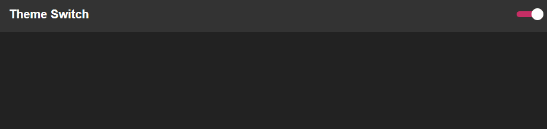

<p align="center">
  
</p>

## :rocket: Technologies

This project was developed with the following technologies:

- [ReactJS](https://reactjs.org/)

## :information_source: How To Use

To clone and run this application, you'll need [Git](https://git-scm.com), [Node.js v10.16][nodejs]. From your command line:

```bash
# Clone this repository
$ git clone https://github.com/IgorMarchi/themeSwitcher--1 themeSwitcher
# Go into the repository
$ cd themeSwitcher
# Install dependencies
$ npm install
# Run project
$ npm start
```

## :memo: License

This project is under the MIT license. See the [LICENSE](https://github.com/IgorMarchi/themeSwitcher--1/blob/master/LICENSE) for more information.

With ❤ [Igor Marchi](https://www.linkedin.com/in/igor-marchi/) :laughing:
